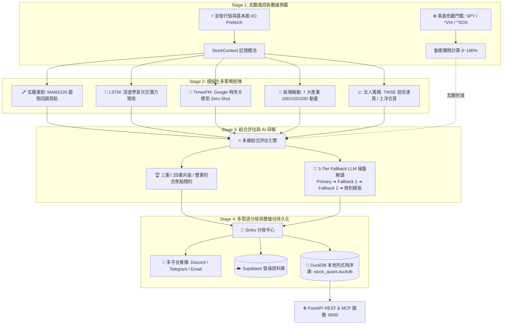

# 🚀 Stock Quantitative Multi-Strategy Platform (股票多維量化決策平台)

[](https://www.python.org/)
[](https://fastapi.tiangolo.com/)
[](https://duckdb.org/)
[](https://www.docker.com/)
[](https://hub.docker.com/r/tbdavid2019/stock-underdog-ml)
[](LICENSE)

現代化、高擴充性、生產級 **AI 深度學習與多維量化交易決策系統**。整合 **美股宏觀門檻**、**玄鐵均線技術分析**、**LSTM 價格預測**、**Google TimesFM 2.5 時序大模型**、**7 大板塊資金輪動**、**台股三大法人籌碼鎖碼**、**👑 四重共振與 🏆 三重共振極選**、**3 級 Fallback LLM 操盤解讀**、**本地 DuckDB 列式時序庫** 與 **16 大 FastMCP / WebMCP 工具服務**。

---

## 🏗️ 系統架構圖 (Architecture Overview)



---

## 🎯 核心功能與策略矩陣

### 1. 🌐 宏觀風控門檻與總經日曆 (Macro Regime Gate & Investing Calendar)
* 每日預檢大盤指標：**S&P 500 (`SPY`)**、**VIX 恐慌指數 (`^VIX`)**、**費城半導體 (`^SOX`)** 與 **台灣加權 (`^TWII`)**。
* 動態識別市場情境：`全面多頭` (100% 曝險)、`多頭回調` (85% 曝險)、`避險防禦` (30~50% 曝險) 與 `極度恐慌` (0% 空倉)。
* 透過 2MD 整合 **Investing.com** 實時數據：**CME FedWatch** 聯準會降息機率、**美股重量級財報行事曆**、**關鍵大宗商品（黃金、原油、期銅）** 以及 **全球重磅總經行事曆（CPI、非農 NFP）**。
* 當費半跌破季線時，自動觸發科技股部位上限保護。
* **Polymarket 預測市場**為輔助情緒訊號：`fed_real_money_odds` 與市場 `probability` 使用 0~100 百分比；上游失敗時 API 會標記 `success=false`，若有上一筆有效快取則同時標記 `stale=true`，不把過期資料假裝成即時資料。

### 2. 🗡️ 玄鐵重劍策略 (XuanTie Trend Pullback)
* 核心思維：「**順大勢（MA60/120 多頭排列）、逆小勢（回踩均線支撐）**」。
* 精確捕捉股價回測 MA60 季線 (`MA60 Pullback`) 或 MA120 半年線之波段技術買點。

### 3. 🤖 LSTM 深度學習預測 (Deep Learning Forecaster)
* 針對目標股票最近 60 個交易日量價特徵進行深度學習推論，輸出次日預測目標價與潛在漲跌幅潛力（`Potential %`）。

### 4. 🔮 Google Research TimesFM 時序大模型 (Time Series Foundation Model)
* 採用 Google 預訓練之 **TimesFM 2.5** 解碼器架構時序基礎模型，以 **Zero-Shot 純推論模式** 進行全市場並發評估。
* 輸出 1~5 日預測目標價軌跡，並同步計算 **P10 (下行防守位)**、**P50 (中位預期)** 與 **P90 (上行獲利位)**。
* 以設定 horizon 的 **P50 中位預期 / P10 下行防守位**計算真實盈虧比 (Risk/Reward Ratio)；P90 僅作上行參考，輸出 `TimesFM強`、`TimesFM看漲`、`高盈虧比` 標籤。
* 與 LSTM 形成 **「雙 ML 交叉驗證」**（微觀個股量價記憶 ∩ 宏觀預訓練波形共振），並支援晉升為 **「👑 四重共振極選」**。

### 5. 🌊 7 大產業板塊資金輪動 (Sector Rotation Strategy)
* 即時追蹤台股與美股 7 大核心板塊：`半導體與IC設計`、`AI伺服器與電子科技`、`金融保險`、`重電與綠能基建`、`航運與原物料`、`傳統產業與化學`、`生技醫療與太空概念`。
* 計算各板塊 10D (40%) + 15D (30%) + 20D (30%) 加權動量資金流，挑選當日前 3 大主流強勢板塊。

### 6. 📈 台灣三大法人籌碼分析 (TWSE Institutional Flow)
* 直連 **臺灣證券交易所 (TWSE T86 / MI_QFIIS)** 與 **櫃買中心 (TPEX)** 官方開放數據。
* 自動統計 5日/20日 外資與投信累計買賣超（張數），識別 **「投信連買 >= 3 天」** 與 **「土洋合買」** 主力鎖碼個股。

### 7. ⭐ 🏆 三重共振 / 👑 四重共振極選評估 (Multi-Strategy Resonance)
* 跨維度篩選同時符合 **「技術買點 ∩ ML 看漲 ∩ 投信/外資主力大買」** 之最高信心標的。
* 自動貼上 `👑四重共振`、`🏆三重共振`、`🔮雙ML共振`、`土洋合買`、`投信連買`、`高盈虧比`、`主流板塊`、`低PE` 等量化標籤。

### 8. 🧠 3 級 Fallback AI 研報引擎 (AI Narrative Generator)
* 支援 **Primary ➔ Fallback 1 ➔ Fallback 2 ➔ 純程式規則模板** 4 級容錯。
* 採用標準 OpenAI 相容協定，支援 Google Gemini 2.5 Flash、DeepSeek-V3、OpenAI GPT-4o-mini 或自建 Gateway。
* 無 API Key 時自動平滑降級為確定性規則模板，確保推播與日報 100% 不中斷。

### 9. 🦆 本地 DuckDB 列式時序庫與雙備份架構
* 本地採用高性能嵌入式列式資料庫 **DuckDB**（`data/storage/stock_quant.duckdb`），已納入 44,000+ 筆歷史時序記錄（壓縮後僅 4.1 MB）。
* 支援零延遲 Pandas 查詢、一鍵導出 `.parquet` 冷備份，並提供一鍵資料庫全量同步工具：
  ```bash
  python scripts/export_supabase_to_duckdb.py
  ```

### 9. ⏰ 盤前買進決策排程與純股市數據庫 (Pre-Market Schedule & Raw Data Warehouse)
本系統核心定位為**「開盤前的進場買進指南（Pre-Market Buy Guide）」**，所有計算與數據抓取均嚴格在市場開盤前完成，並透過 `--market auto` 實施智慧時段防護（白天專注台股、夜間專注美股，非手動指定全市場時杜絕資源浪費）：

* **🇹🇼 台股開盤前指南 (每日 08:00 執行 / UTC 00:00，時段 05:00~13:30 派發)**：
  - 於台股 08:30 試撮與 09:00 開盤前完成運算與推播。
  - 自動同步前一交易日台股全市場收盤行情、三大法人盤後結算籌碼以及昨夜美股收盤連動。
  - 夜間時段嚴格停止台股運算，避免重複消耗 CPU 與記憶體資源。
* **🇺🇸 美股開盤前指南 (每日 20:30 執行 / UTC 12:30，時段 13:30~05:00 派發)**：
  - 於美股 21:30 (夏令) / 22:30 (冬令) 開盤前 1 小時產出 S&P 500 多維量化決策與 Google TimesFM 預測。
  - 白天時段嚴格停止美股重複運算。
* **🔧 yfinance 自動巡檢 (每日 07:30 執行 / UTC 23:30)**：
  - 於台股盤前排程前自動檢測 PyPI 最新版本並驗證 API 相容性。

**📥 自動抓取與持久化之「純股市數據（Raw Market Data）」：**

| 純數據資料表 / 路徑 | 數據來源 | 欄位與內容 | 用途與優勢 |
| :--- | :--- | :--- | :--- |
| **`tw_daily_bars`**<br>(DuckDB) | TWSE & TPEX<br>官方 OpenAPI | • 開高低收 (OHLC)<br>• 成交量 (Volume)<br>• 成交金額 (Trade Value)<br>• 漲跌幅與交易筆數 | 1~2 秒內全量同步上市櫃 1,800+ 檔純行情，提供限流備援 |
| **`tw_institutional_daily`**<br>(DuckDB) | 證交所 T86<br>官方結算表 | • 外資買/賣/淨買超<br>• 投信買/賣/淨買超<br>• 自營商買/賣/淨買超<br>• 三大法人合計淨買超 | 累積 510,000+ 筆歷史純籌碼，支援投信連買與土洋合買分析 |
| **`tw_broker_trades`**<br>(DuckDB) | 券商分點進出明細 | • 分點代號與名稱<br>• 買進張數 / 賣出張數<br>• 累計買賣超與佔比 | 追蹤高盛、大摩、富邦、元大等主力分點連續加減倉水庫曲線 |
| **`macro_regimes`**<br>(DuckDB) | 全球宏觀指數 | • S&P 500 (`SPY`)<br>• VIX 恐慌指數 (`^VIX`)<br>• 費城半導體 (`^SOX`)<br>• MA60 季線水位與建議曝險 | 判定全球系統性風險，自動啟動科技股倉位上限風控 |
| **`data/cache/`**<br>(Parquet / Pickle) | 標的成分股序列 | • 台灣50 (`TW0050`)<br>• 台灣中型100 (`TW0051`)<br>• S&P 500 (`SP500`)<br>完整 6 個月 OHLCV 日 K 線 | 本地零延遲時序快取，加速特徵工程與策略回測 |

**🌍 全球證券清冊與最後成功快照：**

清冊與日 K 分離保存。`market_universe` 是跨市場主檔，支援 `TW`、`US`、`HK` 及未來新增的 `JP`、`CN`、`GB`、`EU` 等市場；每個官方來源使用獨立 provider、獨立 cache 與獨立同步狀態。

| 官方來源 | Provider / Cache | 標準化內容 |
| :--- | :--- | :--- |
| TWSE + TPEx | `TwseTpexProvider` / `cache/universe/TW.json` | 上市、上櫃代號、名稱、交易所、Yahoo 標準代號；成功時同步 `tw_daily_bars` |
| NASDAQ / NYSE / AMEX / ARCA / BATS / IEX | `NasdaqTraderProvider` / `cache/universe/US-NASDAQ-TRADER.json` | NASDAQ Trader `nasdaqlisted.txt`、`otherlisted.txt`，保留交易所、Market Category、Financial Status、Round Lot |
| HKEX | `HkexProvider` / `cache/universe/HK-HKEX.json` | 股票代號、官方提供的名稱、ISIN、Board Lot、證券類別 |
| JPX / TSE | `JpxProvider` / `cache/universe/JP-JPX.json` | 4 位代號、英文名稱、Prime/Standard/Growth/ETF 等產品分類 |
| SSE | `SseProvider` / `cache/universe/CN-SSE.json` | A 股、B 股、科創板代號、中文/英文名稱、上市板別 |
| SZSE | `SzseProvider` / `cache/universe/CN-SZSE.json` | A 股、B 股代號、中文/英文名稱、主板/創業板分類 |
| Euronext | `EuronextProvider` / `cache/universe/EU-EURONEXT.json` | 官方 `stocks-all-places` 完整 CSV；各交易地點 MIC、代號、名稱、ISIN |
| LSE | `LseProvider` / `cache/universe/GB-LSE.json` | SETS、SETSqx、EQS 官方證券清單、Mnemonic、ISIN、證券類別 |

每次全球同步會依序更新上述七個非台灣官方來源；TWSE/TPEx 則由台股同步入口一起更新。每個來源只有在資料完整、欄位有效且筆數通過檢查後才會替換自己的 cache。上游逾時、空資料、格式錯誤或單一來源失敗時，系統只對該來源保留最後成功快照，API 以 `stale=true`、`snapshot_date`、`cache_age_days` 與 `error` 明確標示，不把舊資料偽裝成最新資料。查詢端點：`GET /api/v1/market/universe?source_id=TW`。

官方來源參考：[Nasdaq Trader Symbol Directory](https://www.nasdaqtrader.com/Trader.aspx?id=SymbolDirDefs)、[HKEX Securities Lists](https://www.hkex.com.hk/Services/Trading/Securities/Securities-Lists?sc_lang=en)、[JPX TSE-listed Issues](https://www.jpx.co.jp/english/markets/statistics-equities/misc/01.html)、[Euronext Stocks Directory](https://live.euronext.com/en/products/equities/list)、[LSE UK and European Securities](https://www.londonstockexchange.com/equities-trading/asset-classes/shares-trading/uk-and-european-securities)。

---

## 🌐 互動式操盤首頁、FastAPI REST 與 MCP 服務

本平台內建現代化 FastAPI 高效能對外服務（預設連接埠 `8088`），同時提供「人類操盤視覺化儀表板」、「Anthropic Claude Desktop MCP 工具伺服器」以及「AI Agent Skill」：

### 1. 📊 現代化量化操盤首頁 (Web Dashboard)
啟動後直接瀏覽 `http://localhost:8088/` 或 `http://10.9.0.99:8088/`：
* **宏觀風控看板**：即時掌握 VIX 恐慌指數、S&P 500、費城半導體均線狀態與建議曝險比例。
* **策略即時切換**：快速瀏覽 🏆 三重共振焦點股、玄鐵 MA60/120 回調買點、LSTM 看漲/看跌榜、🔮 TimesFM 預測 TOP 看漲榜與 🛡️ TimesFM 避險榜。
* **個股歷史查詢**：可輸入股票代號或公司名稱（如 `2330.TW`、`NVDA`、`特斯拉`、`聯華電子`）；系統會先解析為標準代號，查無法辨識或查無資料時明確提示，不會沿用上一筆結果。
* **Agent & MCP 中心**：提供一鍵複製 Claude Desktop、Cursor 與 Python 串接代碼。

### 2. 🤖 Model Context Protocol (MCP) 原生工具伺服器
提供符合 Anthropic 官方標準的 FastMCP 伺服器（[`mcp_server.py`](file:///Users/david/git/tbdavid2019/stock-underdog-ml/mcp_server.py)），可直接掛載至 Claude Desktop、Cursor、Antigravity：

**Claude Desktop 設定 (`claude_desktop_config.json`)：**
```json
{
  "mcpServers": {
    "stock-quant": {
      "command": "python",
      "args": [
        "/home/david/stock-underdog-ml/mcp_server.py"
      ]
    }
  }
}
```

**支援之 16 大標準量化 MCP 函數 (FastMCP & WebMCP 原生工具)：**

1. `get_market_macro_regime`: 總經風控與建議曝險比例 (0~100%)。
2. `get_triple_resonance_stocks`: 查詢 👑四重共振、🏆三重共振、🔮雙ML共振焦點多策略交集個股。
3. `get_xuantie_pullback_stocks`: 玄鐵重劍 MA60/120 波段回踩買點標的。
4. `get_lstm_top_predictions`: LSTM 深度學習次日預測漲跌幅排行。
5. `get_timesfm_top_predictions`: Google Research TimesFM 2.5 5 日預測漲跌榜與真實盈虧比 (Risk/Reward)。
6. `get_stock_history`: 個股時序預測軌跡與法人籌碼。
7. `get_latest_market_snapshot`: 最新全市場日報批次數據快照。
8. `get_top_institutional_flows`: 三大法人（外資、投信、自營商）買賣超焦點股排行榜。
9. `get_broker_trades_for_stock`: 關鍵券商主力分點進出明細與累計買賣超。
10. `get_company_profile`: 2MD 繁中公司營運簡介與即時新聞。
11. `get_fed_rate_monitor`: CME FedWatch 利率決策機率與 FOMC 倒數。
12. `get_us_earnings_calendar`: 美股重量級企業財報公布行事曆（EPS、營收預估）。
13. `get_economic_calendar`: 全球重大總經行事曆（CPI、非農 NFP 等）。
14. `get_commodities_summary`: 關鍵大宗商品（黃金 Gold、銅博士 Copper、原油 WTI）實時行情。
15. `resolve_stock_ticker`: 中英文公司名稱模糊搜尋與代號解析（如台積電 ➔ `2330.TW`）。
16. `get_polymarket_macro_sentiment`: Polymarket 真金白銀預測市場宏觀情緒（聯準會降息機率、美股牛熊、科技AI突破、地緣政治衰退機率）。

### 3. 📖 Agent Skill 規範檔 (`SKILL.md`)
本專案已建立標準 Agent 技能規範檔 [`skills/stock-quant/SKILL.md`](file:///Users/david/git/tbdavid2019/stock-underdog-ml/skills/stock-quant/SKILL.md)，亦可直接透過 API 獲取：`http://localhost:8088/skill`。

### 4. 核心 REST API 端點清單

| 端點 | 方法 | 說明 |
| :--- | :---: | :--- |
| `/` | `GET` | 互動式操盤儀表板與 Agent 整合中心 (HTML) |
| `/llms.txt` | `GET` | 符合 [llmstxt.org](https://llmstxt.org/) 規範之 AI Agent / LLM 系統摘要與端點導引 |
| `/llms-full.txt` | `GET` | 完整開發者與大模型參考手冊 (含數學公式、DuckDB Schema、MCP 工具定義) |
| `/.well-known/mcp.json` | `GET` | WebMCP 遠端發現規格清單 (16 大量化工具宣告) |
| `/mcp/sse` | `GET` | WebMCP SSE (Server-Sent Events) 雙向遠端串流通訊端點 |
| `/.well-known/ai-plugin.json` | `GET` | WebMCP / OpenAI Plugin 標準宣告檔 |
| `/skill` | `GET` | 取得 Agent Skill 規範檔 (Markdown) |
| `/health` | `GET` | 系統健康狀態與 DuckDB 總記錄筆數 |
| `/api/v1/predictions/latest` | `GET` | 查詢多指數最新各標的現價、預測價、均線數據、PE/PB 估值與籌碼 |
| `/api/v1/predictions/resonance` | `GET` | 篩選 **👑四重共振 / 🏆三重共振 / 🔮雙ML共振** 重點焦點股 |
| `/api/v1/predictions/xuantie` | `GET` | 篩選 **玄鐵重劍技術買點**（回測 MA60 季線 / MA120 半年線） |
| `/api/v1/predictions/lstm/top-bullish` | `GET` | 查詢 **LSTM 預測漲幅 TOP N** 短線看漲榜 |
| `/api/v1/predictions/lstm/top-bearish` | `GET` | 查詢 **LSTM 預測跌幅 TOP N** 避險/放空觀察榜 |
| `/api/v1/predictions/timesfm/top-bullish` | `GET` | 查詢 **Google TimesFM 預測漲幅 TOP N** 看漲榜與盈虧比 |
| `/api/v1/predictions/timesfm/top-bearish` | `GET` | 查詢 **Google TimesFM 預測跌幅 TOP N** 避險/破底防禦榜 |
| `/api/v1/predictions/history/{ticker}` | `GET` | 查詢單一標的（如 `2330.TW`、`AAPL`）之時間序列歷史軌跡 |
| `/api/v1/predictions/resolve/{query}` | `GET` | 將股票代號、英文/中文公司名稱解析為標準代號 |
| `/api/v1/macro/latest` | `GET` | 即時取得台美股大盤宏觀風控狀態、建議曝險、FedWatch 降息機率與總經催化劑 |
| `/api/v1/macro/investing/summary` | `GET` | Investing.com 一站式總經數據（FedWatch、美股財報、大宗商品、行事曆） |
| `/api/v1/macro/polymarket/sentiment` | `GET` | Polymarket 真金白銀宏觀預測市場情緒（含降息預期與各類大事件機率） |
| `/api/v1/macro/investing/fed-rate` | `GET` | CME FedWatch 聯準會降息機率分布表與 FOMC 倒數 |
| `/api/v1/macro/investing/earnings-calendar` | `GET` | 美股重量級企業財報行事曆（EPS、營收預估、市值規模） |
| `/api/v1/macro/investing/commodities` | `GET` | 關鍵大宗商品（黃金、銅博士、WTI 原油）即時行情與週期漲跌 |
| `/api/v1/macro/investing/economic-calendar` | `GET` | 全球重大總經行事曆（CPI、非農 NFP 等） |
| `/api/v1/market/institutional/top` | `GET` | 三大法人買賣超焦點排行 |
| `/api/v1/market/universe` | `GET` | 全球證券清冊、來源 snapshot 與 stale/cache freshness 狀態 |
| `/api/v1/market/broker/summary/{ticker}` | `GET` | 券商主力分點累計買賣超統計 |
| `/api/v1/market/company-profile` | `GET` | 2MD 個股繁體中文營運簡介與新聞 |
| `/api/v1/market/company-profiles/batch` | `POST` | 並發非同步批次預載多支股票之公司營運摘要 |
| `/api/v1/stats/summary` | `GET` | DuckDB 時序庫全盤統計（總記錄數、涵蓋股票數、時間跨度） |

---

## 🚀 快速開始 (Quick Start)

### 1. 環境配置

複製環境變數範本並填入必要設定：

```bash
cp .env.example .env
```

**關鍵配置項 (`.env`)：**
```bash
# 雲端 Supabase 資料庫 (必填)
SUPABASE_URL=https://your-project.supabase.co
SUPABASE_SERVICE_KEY=your_service_role_key

# 本地 DuckDB 路徑 (預設: data/storage/stock_quant.duckdb)
ENABLE_DUCKDB=true
DUCKDB_PATH=data/storage/stock_quant.duckdb

# 3-Tier Fallback LLM 操盤解讀配置 (選填，無 Key 則使用純規則模板)
LLM_PRIMARY_BASE_URL=https://generativelanguage.googleapis.com/v1beta/openai/
LLM_PRIMARY_MODEL=gemini-2.5-flash
LLM_PRIMARY_API_KEY=your_gemini_key

LLM_FALLBACK1_BASE_URL=https://api.deepseek.com/v1
LLM_FALLBACK1_MODEL=deepseek-chat
LLM_FALLBACK1_API_KEY=your_deepseek_key

# 推播通知 (選填)
DISCORD_WEBHOOK_URL=https://discord.com/api/webhooks/...
TELEGRAM_BOT_TOKEN=your_bot_token
TELEGRAM_CHAT_ID=your_chat_id
```

---

### 2. 執行方式 A：本機 Python 原生模式（推薦開發與除錯）

```bash
# 建立並啟用虛擬環境
python3.12 -m venv venv
source venv/bin/activate

# 安裝依賴
pip install -r requirements.txt

# 1. 執行開盤前多維量化分析指南
python main.py                     # 智慧判定 (預設 auto: 白天 05:00~13:30 跑台股；夜間 13:30~05:00 跑美股)
python main.py --market tw         # 🇹🇼 台股開盤前指南 (08:00 執行，台灣50 + 台灣中型100)
python main.py --market us         # 🇺🇸 美股開盤前指南 (20:30 執行，S&P 500)
python main.py --market all        # 🌐 全市場手動指定 (台灣50 + 台灣中型100 + S&P 500)
python main.py --dry-run           # 乾跑模式 (不寫入 DB 且不發送推播)

# 2. 啟動 FastAPI REST 服務 (Port 8088)
python api/main.py

# 3. 執行全套單元測試
python -m unittest discover -s test -p 'test_*.py'

# 4. 從 Supabase 全量導出歷史資料至 DuckDB
python scripts/export_supabase_to_duckdb.py
```

---

### 3. 執行方式 B：Docker 容器化模式（推薦無人值守生產部署）

本專案提供預先構建完成之 **Docker Hub 官方多架構映像檔**，支援 **`linux/amd64` (Intel/AMD x64)** 與 **`linux/arm64` (Apple Silicon M系列 / ARM 伺服器)** 雙架構。

> 💡 **為什麼強烈推薦使用預建映像檔？**
> 本專案整合 PyTorch、TensorFlow、DuckDB 等大型科學計算與深度學習依賴庫，若在本地自行從原始碼構建 (`docker build`) 通常需耗時 10~20 分鐘以上，且極易因本機記憶體不足或編譯工具差異中斷。
> 官方 GitHub Actions CI/CD 會在每次更新時自動完成雙架構優化編譯與全量單元測試，發布至 Docker Hub，**直接 `docker pull` 數十秒內即可完成部署！**

#### 🐳 A. 直接拉取 Docker Hub 官方映像檔
```bash
# 1. 直接拉取 Docker Hub 最新多架構映像檔 (強烈推薦，免本地編譯)
docker pull tbdavid2019/stock-underdog-ml:latest

# (備援鏡像) 或使用 GitHub Container Registry (GHCR)
docker pull ghcr.io/tbdavid2019/stock-underdog-ml:latest
```

#### 🚀 B. 使用 Docker Compose 一鍵啟動 (推薦)
```bash
# 1. 一鍵拉取 Docker Hub 預建映像檔 (免本地 Build)
docker compose pull

# 2. 啟動 FastAPI REST & Web UI 服務 (常駐背景: http://localhost:8088)
docker compose up -d stock-ml-api

# 3. 啟動 24H 定時排程容器 (依台北時間台股盤前 08:00 與美股盤前 20:30 自動產出買進指南)
docker compose up -d stock-ml-cron

# 4. 手動單次執行指定市場盤前指南
docker compose run --rm stock-ml python main.py --market auto  # 依時段智慧派發台股或美股 (預設)
docker compose run --rm stock-ml python main.py --market tw    # 🇹🇼 強制執行台股
docker compose run --rm stock-ml python main.py --market us    # 🇺🇸 強制執行美股

# 5. 容器內執行 Supabase ➔ DuckDB 資料同步
docker compose run --rm stock-ml-sync

# 6. 容器內執行全套單元測試
docker compose run --rm stock-ml-test
```

#### ⚡ C. 單行命令直接啟動（無需 Clone 原始碼專案）
```bash
docker run -d \
  -p 8088:8088 \
  --name stock-ml-api \
  --restart unless-stopped \
  -v $(pwd)/data/storage:/app/data/storage \
  -v $(pwd)/logs:/app/logs \
  tbdavid2019/stock-underdog-ml:latest
```

---

## 📂 專案目錄結構 (Project Structure)

```text
stock-underdog-ml/
├── api/                        # FastAPI REST & MCP 服務模組
│   ├── routes/                 # predictions, macro, stats 路由
│   ├── schemas.py              # Pydantic v2 資料結構
│   └── main.py                 # FastAPI 入口與 CORS/Swagger 配置
├── core/                       # 核心基礎設施
│   ├── config.py               # 集中式環境配置 (LLM, 板塊, DB)
│   └── device.py               # CUDA / MPS / CPU 硬體管理
├── data/                       # 資料獲取與時序儲存
│   ├── cache.py                # 指數與行情快取管理器
│   ├── duckdb_manager.py       # DuckDB 本地列式時序資料庫
│   ├── fetcher.py              # 行情與 Answerbook 榜單抓取
│   ├── fundamentals.py         # PE/PB/EV/EBITDA 基本面抓取
│   ├── institutional.py        # TWSE/TPEX 三大法人籌碼分析器
│   └── macro.py                # 美股宏觀風控分析器 (SPY/VIX/SOX)
├── models/                     # 機器學習與時序大模型封裝
│   ├── lstm.py                 # LSTM 深度學習架構與訓練/推論管線
│   └── timesfm_model.py        # Google TimesFM 2.5 預訓練模型載入與分位數風險評估
├── strategies/                 # 插件式量化策略註冊中心
│   ├── base.py                 # BaseStrategy 抽象基底類別
│   ├── registry.py             # 策略自動發現與註冊中心
│   ├── xuantie.py              # 玄鐵重劍均線趨勢回調策略
│   ├── lstm.py                 # LSTM 深度學習價格預測策略
│   ├── timesfm.py              # Google TimesFM 時序大模型預測策略 (P10/50/90 盈虧比)
│   ├── sector_rotation.py      # 7 大板塊資金輪動策略
│   └── institutional.py        # 三大法人連買與土洋合買策略
├── evaluators/                 # 綜合評價與研報引擎
│   ├── composite_evaluator.py  # 多策略動態評分與四重/三重共振標籤
│   ├── ai_narrative.py         # 3 級 Fallback LLM 操盤解讀引擎
│   └── formatter.py            # 美化終端機與推播日報排版工具
├── pipeline/                   # 分層管線排程器
│   └── orchestrator.py         # 4-Stage 量化管線執行調度器
├── docker/                     # 容器化腳本與排程
│   ├── entrypoint.sh           # 多模式啟動入口 (預設安全導向 api)
│   └── crontab                 # 台北時區定時排程定義
├── scripts/                    # 遷移與維護腳本
│   ├── export_supabase_to_duckdb.py # Supabase ➔ DuckDB 全量遷移工具
│   └── sync_twse_market.py     # TWSE / TPEX 官方 OpenAPI 全市場日 K 棒批量同步
├── test/                       # 自動化測試套件 (104 項全量單元測試)
├── Dockerfile                  # 生產級 Python 3.12 Slim 映像 (CMD api)
├── docker-compose.yml          # 多服務 Docker 堆疊定義 (Hugging Face 權重快取掛載)
└── main.py                     # CLI 主程序入口 (--market auto 智慧時段判定)
```

---

## 🌐 線上服務與 WebMCP / Agent 入口 (Live Endpoints)

* **🖥️ 即時操盤儀表板**: [https://stockdata.david888.com](https://stockdata.david888.com)
* **🤖 WebMCP SSE 串流**: `https://stockdata.david888.com/mcp/sse`
* **📑 WebMCP Manifest**: `https://stockdata.david888.com/.well-known/mcp.json` & `/mcp.json`
* **📄 LLM Context 協議**: `https://stockdata.david888.com/llms.txt` & `/llms-full.txt`
* **🌉 Cloudflare WebMCP Bridge**: `https://stockdata.david888.com/.webmcp/bridge.js`
* **📘 Swagger API 文件**: `https://stockdata.david888.com/docs`

首頁也提供標準 SEO 與社群分享資源：`/favicon.svg`、`/favicon-32x32.png`、`/apple-touch-icon.png`、`/og-image.png` 與 `/site.webmanifest`。

---

## 🤖 GitHub Actions 自動化 CI/CD

本專案配置了完整 GitHub Actions 自動化流程（`.github/workflows/docker-ci-cd.yml`）：
1. **🧪 測試關卡 (Test Gate)**：每次 Push / PR 自動執行全量單元測試。
2. **🐳 多架構構建**：測試通過後自動構建 `linux/amd64` (Intel/AMD) 與 `linux/arm64` (Apple Silicon / ARM) 雙架構映像。
3. **📦 自動推送**：發布至 GitHub Container Registry (`ghcr.io/tbdavid2019/stock-underdog-ml`) 與 Docker Hub。

### 🔐 自動更新與主線保護

- `yfinance` 排程檢查只會建立 dependency update PR，通過一般 PR CI 後再合併，不直接推送 `main`，也不使用 `[skip ci]` 繞過驗證。
- 建議在 GitHub `main` 分支設定 branch protection：要求 CI/CD workflow 通過、啟用 force-push/delete 保護；個人專案仍可由專案擁有者自行合併 PR。
- 直接推送 `main` 會觸發測試與 Docker pipeline，但不會產生 PR，因此不會有 PR Agent 的 inline review 留言。

---

## 📜 開發規範與文件同步

遵循本專案開發鐵律（`AGENTS.md`）：
- 每次功能或行為變更均同步記錄於 [`CHANGELOG.md`](CHANGELOG.md)。
- Docker 詳細指南請參閱 [`docs/DOCKER.md`](docs/DOCKER.md)。
- OpenSpec 變更與規格請參閱 [`openspec/specs/`](openspec/specs/)。

---

## 📄 授權條款 (License)

本專案採用 [GNU AGPL-3.0 License](LICENSE) 授權。
