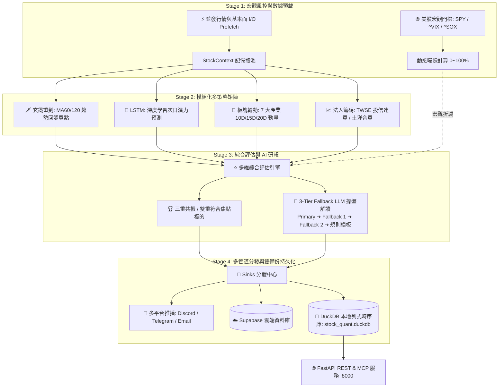

# 🚀 Stock Quantitative Multi-Strategy Platform (股票多維量化決策平台)

[](https://www.python.org/)
[](https://fastapi.tiangolo.com/)
[](https://duckdb.org/)
[](https://www.docker.com/)
[](https://opensource.org/licenses/MIT)

現代化、高擴充性、生產級 **AI 深度學習與多維量化交易決策系統**。整合 **美股宏觀門檻**、**玄鐵均線技術分析**、**LSTM 價格預測**、**7 大板塊資金輪動**、**台股三大法人籌碼鎖碼**、**🏆 三重共振極選**、**3 級 Fallback LLM 操盤解讀**、**本地 DuckDB 列式時序庫** 與 **FastAPI REST / MCP 服務**。

---

## 🏗️ 系統架構圖 (Architecture Overview)



---

## 🎯 核心功能與策略矩陣

### 1. 🌐 美股宏觀風控門檻 (Macro Regime Gate)
* 每日預檢美股三大指標：**S&P 500 (`SPY`)**、**VIX 恐慌指數 (`^VIX`)** 與 **費城半導體 (`^SOX`)**。
* 動態識別 4 種市場情境：`全面多頭` (100% 曝險)、`多頭回調` (85% 曝險)、`避險防禦` (30~50% 曝險) 與 `極度恐慌` (0% 空倉)。
* 當費半跌破季線時，自動觸發科技股部位上限保護。

### 2. 🗡️ 玄鐵重劍策略 (XuanTie Trend Pullback)
* 核心思維：「**順大勢（MA60/120 多頭排列）、逆小勢（回踩均線支撐）**」。
* 精確捕捉股價回測 MA60 季線 (`MA60 Pullback`) 或 MA120 半年線之波段技術買點。

### 3. 🤖 LSTM 深度學習預測 (Deep Learning Forecaster)
* 針對目標股票最近 60 個交易日量價特徵進行深度學習推論，輸出次日預測目標價與潛在漲跌幅潛力（`Potential %`）。

### 4. 🌊 7 大產業板塊資金輪動 (Sector Rotation Strategy)
* 即時追蹤台股與美股 7 大核心板塊：`半導體與IC設計`、`AI伺服器與電子科技`、`金融保險`、`重電與綠能基建`、`航運與原物料`、`傳統產業與化學`、`生技醫療與太空概念`。
* 計算各板塊 10D (40%) + 15D (30%) + 20D (30%) 加權動量資金流，挑選當日前 3 大主流強勢板塊。

### 5. 📈 台灣三大法人籌碼分析 (TWSE Institutional Flow)
* 直連 **臺灣證券交易所 (TWSE T86 / MI_QFIIS)** 與 **櫃買中心 (TPEX)** 官方開放數據。
* 自動統計 5日/20日 外資與投信累計買賣超（張數），識別 **「投信連買 >= 3 天」** 與 **「土洋合買」** 主力鎖碼個股。

### 6. ⭐ 🏆 三重共振極選評估 (Triple Resonance Evaluation)
* 跨維度篩選同時符合 **「技術買點 ∩ LSTM 看漲 ∩ 投信/外資主力大買」** 之最高信心標的。
* 自動貼上 `🏆三重共振`、`土洋合買`、`投信連買`、`主流板塊`、`低PE` 等量化標籤。

### 7. 🧠 3 級 Fallback AI 研報引擎 (AI Narrative Generator)
* 支援 **Primary ➔ Fallback 1 ➔ Fallback 2 ➔ 純程式規則模板** 4 級容錯。
* 採用標準 OpenAI 相容協定，支援 Google Gemini 2.5 Flash、DeepSeek-V3、OpenAI GPT-4o-mini 或自建 Gateway。
* 無 API Key 時自動平滑降級為確定性規則模板，確保推播與日報 100% 不中斷。

### 8. 🦆 本地 DuckDB 列式時序庫與雙備份架構
* 本地採用高性能嵌入式列式資料庫 **DuckDB**（`data/storage/stock_quant.duckdb`），已納入 44,000+ 筆歷史時序記錄（壓縮後僅 4.1 MB）。
* 支援零延遲 Pandas 查詢、一鍵導出 `.parquet` 冷備份，並提供一鍵資料庫全量同步工具：
  ```bash
  python scripts/export_supabase_to_duckdb.py
  ```

---

## 🌐 互動式操盤首頁、FastAPI REST 與 MCP 服務

本平台內建現代化 FastAPI 高效能對外服務（預設連接埠 `8088`），同時提供「人類操盤視覺化儀表板」、「Anthropic Claude Desktop MCP 工具伺服器」以及「AI Agent Skill」：

### 1. 📊 現代化量化操盤首頁 (Web Dashboard)
啟動後直接瀏覽 `http://localhost:8088/` 或 `http://10.9.0.99:8088/`：
* **宏觀風控看板**：即時掌握 VIX 恐慌指數、S&P 500、費城半導體均線狀態與建議曝險比例。
* **策略即時切換**：快速瀏覽 🏆 三重共振焦點股、玄鐵 MA60/120 回調買點、LSTM 看漲/看跌榜。
* **個股歷史查詢**：輸入股票代號（如 `2330.TW`、`NVDA`）檢索 DuckDB 中的歷史量化預測與技術軌跡。
* **Agent & MCP 中心**：提供一鍵複製 Claude Desktop、Cursor 與 Python 串接代碼。

### 2. 🤖 Model Context Protocol (MCP) 原生工具伺服器
提供符合 Anthropic 官方標準的 FastMCP 伺服器（[`mcp_server.py`](file:///Users/david/Documents/git/tbdavid2019/stock-underdog-ml/mcp_server.py)），可直接掛載至 Claude Desktop、Cursor、Antigravity：

**Claude Desktop 設定 (`claude_desktop_config.json`)：**
```json
{
  "mcpServers": {
    "stock-quant": {
      "command": "python",
      "args": [
        "/Users/david/Documents/git/tbdavid2019/stock-underdog-ml/mcp_server.py"
      ]
    }
  }
}
```

### 3. 📖 Agent Skill 規範檔 (`SKILL.md`)
本專案已建立標準 Agent 技能規範檔 [`skills/stock-quant/SKILL.md`](file:///Users/david/Documents/git/tbdavid2019/stock-underdog-ml/skills/stock-quant/SKILL.md)，亦可直接透過 API 獲取：`http://localhost:8088/skill`。

### 4. 核心 REST API 端點清單

| 端點 | 方法 | 說明 |
| :--- | :---: | :--- |
| `/` | `GET` | 互動式操盤儀表板與 Agent 整合中心 (HTML) |
| `/.well-known/ai-plugin.json` | `GET` | WebMCP / OpenAI Plugin 標準宣告檔 |
| `/skill` | `GET` | 取得 Agent Skill 規範檔 (Markdown) |
| `/health` | `GET` | 系統健康狀態與 DuckDB 總記錄筆數 |
| `/api/v1/predictions/latest` | `GET` | 查詢多指數最新各標的現價、預測價、均線數據、PE/PB 估值與籌碼 |
| `/api/v1/predictions/resonance` | `GET` | 篩選 **雙重符合 / 🏆三重共振** 重點焦點股 |
| `/api/v1/predictions/xuantie` | `GET` | 篩選 **玄鐵重劍技術買點**（回測 MA60 季線 / MA120 半年線） |
| `/api/v1/predictions/lstm/top-bullish` | `GET` | 查詢 **LSTM 預測漲幅 TOP N** 短線看漲榜 |
| `/api/v1/predictions/lstm/top-bearish` | `GET` | 查詢 **LSTM 預測跌幅 TOP N** 避險/放空觀察榜 |
| `/api/v1/predictions/history/{ticker}` | `GET` | 查詢單一標的（如 `2330.TW`、`AAPL`）之時間序列歷史軌跡 |
| `/api/v1/macro/latest` | `GET` | 即時取得美股三大指標（SPY / VIX / SOX）宏觀風控狀態與建議曝險 |
| `/api/v1/stats/summary` | `GET` | DuckDB 時序庫全盤統計（總記錄數、涵蓋股票數、時間跨度） |

---

## 🚀 快速開始 (Quick Start)

### 1. 環境配置

複製環境變數範本並填入必要設定：

```bash
cp .env.example .env
```

**關鍵配置項 (`.env`)：**
```bash
# 雲端 Supabase 資料庫 (必填)
SUPABASE_URL=https://your-project.supabase.co
SUPABASE_SERVICE_KEY=your_service_role_key

# 本地 DuckDB 路徑 (預設: data/storage/stock_quant.duckdb)
ENABLE_DUCKDB=true
DUCKDB_PATH=data/storage/stock_quant.duckdb

# 3-Tier Fallback LLM 操盤解讀配置 (選填，無 Key 則使用純規則模板)
LLM_PRIMARY_BASE_URL=https://generativelanguage.googleapis.com/v1beta/openai/
LLM_PRIMARY_MODEL=gemini-2.5-flash
LLM_PRIMARY_API_KEY=your_gemini_key

LLM_FALLBACK1_BASE_URL=https://api.deepseek.com/v1
LLM_FALLBACK1_MODEL=deepseek-chat
LLM_FALLBACK1_API_KEY=your_deepseek_key

# 推播通知 (選填)
DISCORD_WEBHOOK_URL=https://discord.com/api/webhooks/...
TELEGRAM_BOT_TOKEN=your_bot_token
TELEGRAM_CHAT_ID=your_chat_id
```

---

### 2. 執行方式 A：本機 Python 原生模式（推薦開發與除錯）

```bash
# 建立並啟用虛擬環境
python3.12 -m venv venv
source venv/bin/activate

# 安裝依賴
pip install -r requirements.txt

# 1. 執行全量多維量化分析 (台灣50 + 台灣中型100 + S&P500)
python main.py

# 2. 啟動 FastAPI REST 服務 (Port 8000)
python api/main.py

# 3. 執行全套單元測試 (50 項測試)
python -m unittest discover -s test -p 'test_*.py'

# 4. 從 Supabase 全量導出歷史資料至 DuckDB
python scripts/export_supabase_to_duckdb.py
```

---

### 3. 執行方式 B：Docker 容器化模式（推薦無人值守生產部署）

本專案支援 **x86_64 與 ARM64 雙架構**，並提供完整的多服務配置：

```bash
# 1. 一鍵拉取/構建 Docker 映像
docker compose pull # 或 docker compose build

# 2. 啟動 FastAPI REST 服務 (常駐背景: http://localhost:8000/docs)
docker compose up -d stock-ml-api

# 3. 啟動 24H 定時排程容器 (依台北時間盤後與美股收盤自動出報表)
docker compose up -d stock-ml-cron

# 4. 手動單次執行全量日報
docker compose run --rm stock-ml

# 5. 容器內執行 Supabase ➔ DuckDB 資料同步
docker compose run --rm stock-ml-sync

# 6. 容器內執行全套 50 項單元測試
docker compose run --rm stock-ml-test
```

---

## 📂 專案目錄結構 (Project Structure)

```text
stock-underdog-ml/
├── api/                        # FastAPI REST & MCP 服務模組
│   ├── routes/                 # predictions, macro, stats 路由
│   ├── schemas.py              # Pydantic v2 資料結構
│   └── main.py                 # FastAPI 入口與 CORS/Swagger 配置
├── core/                       # 核心基礎設施
│   ├── config.py               # 集中式環境配置 (LLM, 板塊, DB)
│   └── device.py               # CUDA / MPS / CPU 硬體管理
├── data/                       # 資料獲取與時序儲存
│   ├── cache.py                # 指數與行情快取管理器
│   ├── duckdb_manager.py       # DuckDB 本地列式時序資料庫
│   ├── fetcher.py              # 行情與 Answerbook 榜單抓取
│   ├── fundamentals.py         # PE/PB/EV/EBITDA 基本面抓取
│   ├── institutional.py        # TWSE/TPEX 三大法人籌碼分析器
│   └── macro.py                # 美股宏觀風控分析器 (SPY/VIX/SOX)
├── strategies/                 # 插件式量化策略註冊中心
│   ├── base.py                 # BaseStrategy 抽象基底類別
│   ├── registry.py             # 策略自動發現與註冊中心
│   ├── xuantie.py              # 玄鐵重劍均線趨勢回調策略
│   ├── lstm.py                 # LSTM 深度學習價格預測策略
│   ├── sector_rotation.py      # 7 大板塊資金輪動策略
│   └── institutional.py        # 三大法人連買與土洋合買策略
├── evaluators/                 # 綜合評價與研報引擎
│   ├── composite_evaluator.py  # 多策略動態評分與三重共振標籤
│   ├── ai_narrative.py         # 3 級 Fallback LLM 操盤解讀引擎
│   └── formatter.py            # 美化終端機與推播日報排版工具
├── pipeline/                   # 分層管線排程器
│   └── orchestrator.py         # 4-Stage 量化管線執行調度器
├── docker/                     # 容器化腳本與排程
│   ├── entrypoint.sh           # 多模式啟動入口
│   └── crontab                 # 台北時區定時排程定義
├── scripts/                    # 遷移與維護腳本
│   └── export_supabase_to_duckdb.py # Supabase ➔ DuckDB 全量遷移工具
├── test/                       # 自動化測試套件 (50+ 項單元測試)
├── Dockerfile                  # 生產級 Python 3.12 Slim 映像
├── docker-compose.yml          # 多服務 Docker 堆疊定義
└── main.py                     # CLI 主程序入口
```

---

## 🌐 線上服務與 WebMCP / Agent 入口 (Live Endpoints)

* **🖥️ 即時操盤儀表板**: [https://stockdata.david888.com](https://stockdata.david888.com)
* **🤖 WebMCP SSE 串流**: `https://stockdata.david888.com/mcp/sse`
* **📑 WebMCP Manifest**: `https://stockdata.david888.com/.well-known/mcp.json` & `/mcp.json`
* **📄 LLM Context 協議**: `https://stockdata.david888.com/llms.txt` & `/llms-full.txt`
* **🌉 Cloudflare WebMCP Bridge**: `https://stockdata.david888.com/.webmcp/bridge.js`
* **📘 Swagger API 文件**: `https://stockdata.david888.com/docs`

---

## 🤖 GitHub Actions 自動化 CI/CD

本專案配置了完整 GitHub Actions 自動化流程（`.github/workflows/docker-ci-cd.yml`）：
1. **🧪 測試關卡 (Test Gate)**：每次 Push / PR 自動執行 50 項單元測試。
2. **🐳 多架構構建**：測試通過後自動構建 `linux/amd64` (Intel/AMD) 與 `linux/arm64` (Apple Silicon / ARM) 雙架構映像。
3. **📦 自動推送**：發布至 GitHub Container Registry (`ghcr.io/tbdavid2019/stock-underdog-ml`) 與 Docker Hub。

---

## 📜 開發規範與文件同步

遵循本專案開發鐵律（`AGENTS.md`）：
- 每次功能或行為變更均同步記錄於 [`CHANGELOG.md`](CHANGELOG.md)。
- Docker 詳細指南請參閱 [`docs/DOCKER.md`](docs/DOCKER.md)。
- OpenSpec 變更與規格請參閱 [`openspec/specs/`](openspec/specs/)。

---

## 📄 授權條款 (License)

本專案採用 [MIT License](LICENSE) 授權。
