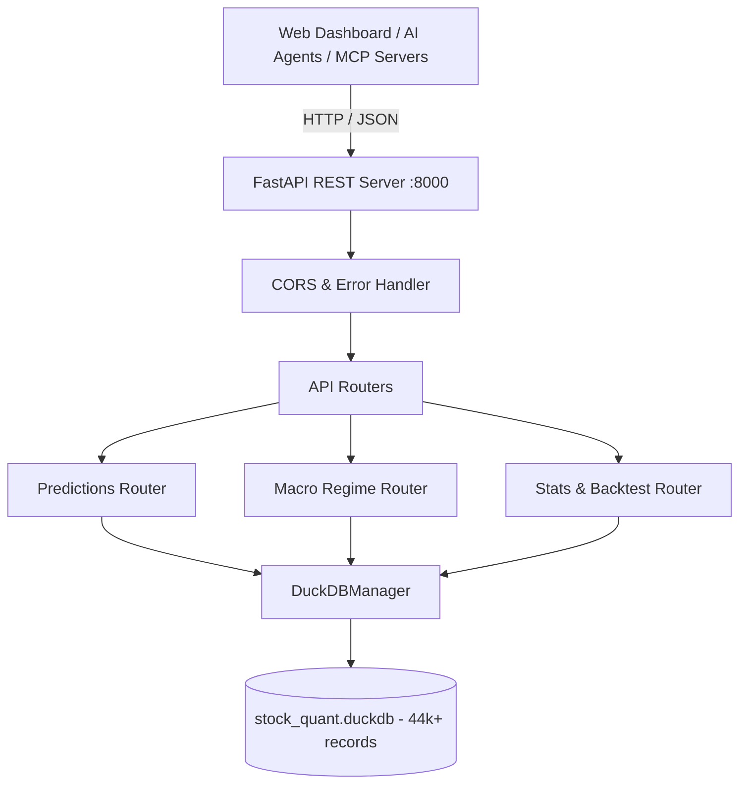

# Design: FastAPI REST & MCP-Ready Service Architecture

## System Architecture

## Endpoints Specification

### 1. Predictions (`/api/v1/predictions`)
- `GET /api/v1/predictions/latest?index_name={台灣50|台灣中型100|美股S&P500}&limit=50`: Returns the most recent snapshot of predictions.
- `GET /api/v1/predictions/resonance?index_name={optional}&min_hits=2`: Returns multi-strategy / triple-resonance stocks.
- `GET /api/v1/predictions/xuantie?index_name={optional}&pullback_type={MA60|MA120}`: Returns XuanTie MA pullback buy candidates.
- `GET /api/v1/predictions/lstm/top-bullish?index_name={optional}&limit=10`: Returns top N predicted gainers.
- `GET /api/v1/predictions/lstm/top-bearish?index_name={optional}&limit=10`: Returns top N predicted losers.
- `GET /api/v1/predictions/history/{ticker}?limit=30`: Returns historical predictions for a given stock ticker.

### 2. Macro Regime (`/api/v1/macro`)
- `GET /api/v1/macro/latest`: Returns latest US macro regime state, VIX, SPY/SOX status, and suggested exposure.

### 3. Analytics & Stats (`/api/v1/stats`)
- `GET /api/v1/stats/summary`: Total row counts, unique tickers, covered indices, earliest and latest date.
- `GET /api/v1/stats/backtest`: Direction accuracy stats by index and model.

## Query Optimization in DuckDB
DuckDB's zero-copy vectorized execution allows sub-5ms aggregations:
- Use `QUALIFY ROW_NUMBER() OVER (PARTITION BY ticker, strategy_type ORDER BY timestamp DESC) = 1` to instantly retrieve the latest state for all tickers without slow subqueries.
