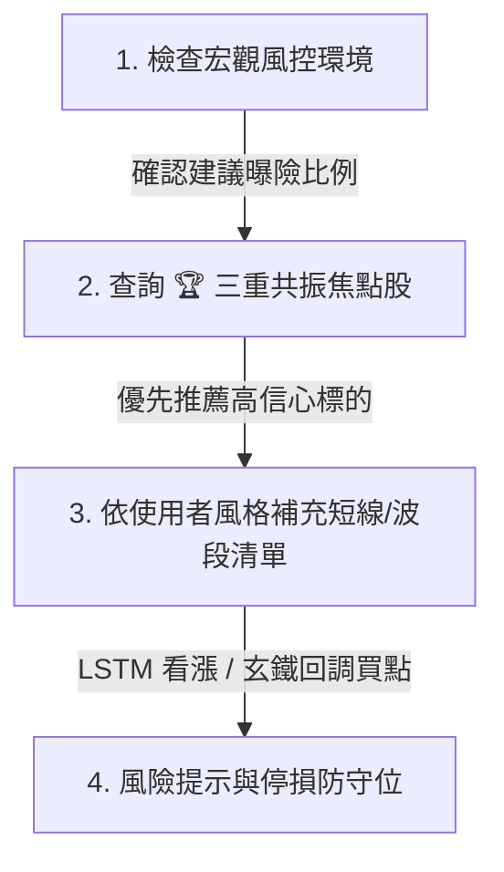

# 📈 Stock Quant AI Agent Skill

## 1. 概述 (Overview)

本 Skill 提供專業級的量化投資決策與標的篩選能力。底層整合 **嵌入式 DuckDB 高速時序資料庫**、**LSTM 深度學習價格預測**、**玄鐵重劍中長線均線波段系統**、**三大法人籌碼追蹤** 以及 **美股總體宏觀風控（Macro Regime）**。

無論是透過 **MCP Tools**、**WebMCP** 或是 **FastAPI REST 端點**，Agent 皆可透過本 Skill 獲取最新最精確的量化數據並進行操盤解讀。

---

## 2. 核心量化因子與訊號解讀 (Quantitative Factors)

| 因子類別 | 關鍵指標 | 訊號意義與操盤含義 |
| :--- | :--- | :--- |
| 🏆 **三重共振** | `is_triple_resonance` | **最高信心買點**：同時滿足「技術面均線買點 ∩ LSTM 看漲 ∩ 投信/外資主力鎖碼 ∩ 估值合理」。 |
| ⚔️ **玄鐵重劍** | `pullback_type` (MA60/120) | **波段操作 (2-4週)**：多頭趨勢中股價回踩季線 (MA60) 或半年線 (MA120) 不破之支撐買點。 |
| 🤖 **LSTM 深度學習** | `potential` (%) | **短線操作 (1-7天)**：預測明日收盤價與目標價空間。`potential > +3%` 視為看漲潛力股。 |
| 🏦 **三大法人籌碼** | `trust_net_5d`, `foreign_net_5d` | **主力籌碼**：`投信連買N天` (Streak >= 3) 或 `土洋合買` (外資投信同步買超)。 |
| 🌍 **宏觀風控** | `macro_regime`, `exposure` | **資金水位控制**：根據 SPY 季線、VIX 恐慌指數、SOX 費半動態調整倉位 (0% ~ 100%)。 |

---

## 3. 建議分析工作流 (Recommended Advisory Workflow)

當使用者詢問今日股市行情、選股推薦或個股診斷時，Agent 應依循以下四步法：

1. **Step 1: 先看大盤環境與建議曝險 (Macro Regime)**
   - 呼叫 `get_market_macro_regime()`。
   - 若 VIX 飆高或費半破季線，提醒使用者降低整體倉位（如半倉 50%）。
2. **Step 2: 首選 🏆 三重共振股票 (Triple Resonance)**
   - 呼叫 `get_triple_resonance_stocks()`。
   - 此類標的兼具基本面估值、法人買超、技術均線支撐與 AI 看漲。
3. **Step 3: 依風格補充候選標的**
   - **波段型投資人**：呼叫 `get_xuantie_pullback_stocks()`（尋找回踩 MA60/120 買點）。
   - **短線型投資人**：呼叫 `get_lstm_top_predictions(direction='bullish')`（尋找短線動量股）。
4. **Step 4: 個股診斷與時間序列確認**
   - 呼叫 `get_stock_history(ticker='2330.TW')` 查看個股近期預測與指標變化趨勢。

---

## 4. MCP Tools 快速對照表

| MCP Tool 名稱 | 參數 | 回傳說明 |
| :--- | :--- | :--- |
| `get_market_macro_regime` | 無 | 美股總經情境、VIX 指數、SPY/SOX 均線狀態、建議曝險百分比 (0~100%) |
| `get_triple_resonance_stocks` | `index_name`, `limit` | 🏆 三重共振與多策略焦點交集股清單 |
| `get_xuantie_pullback_stocks` | `index_name`, `pullback_type`, `limit` | 玄鐵重劍 MA60/MA120 回調買點清單 |
| `get_lstm_top_predictions` | `index_name`, `direction`, `limit` | LSTM 預測漲幅 TOP N 或 跌幅 TOP N 避險榜 |
| `get_stock_history` | `ticker`, `limit` | 指定代號之歷史時序量化預測與指標軌跡 |
| `get_latest_market_snapshot` | `index_name`, `limit` | 當日最新完整日報批次數據 |

---

## 5. REST API 端點對照 (Base URL: `http://10.9.0.99:8088`)

- `GET /api/v1/macro/latest` - 宏觀風控狀態
- `GET /api/v1/predictions/resonance` - 三重共振焦點股
- `GET /api/v1/predictions/xuantie` - 玄鐵均線買點
- `GET /api/v1/predictions/lstm/top-bullish` - LSTM 看漲榜
- `GET /api/v1/predictions/lstm/top-bearish` - LSTM 看跌榜
- `GET /api/v1/predictions/history/{ticker}` - 個股時序歷史
- `GET /api/v1/predictions/latest` - 最新批次日報
- `GET /api/v1/stats/summary` - 資料庫時序統計
