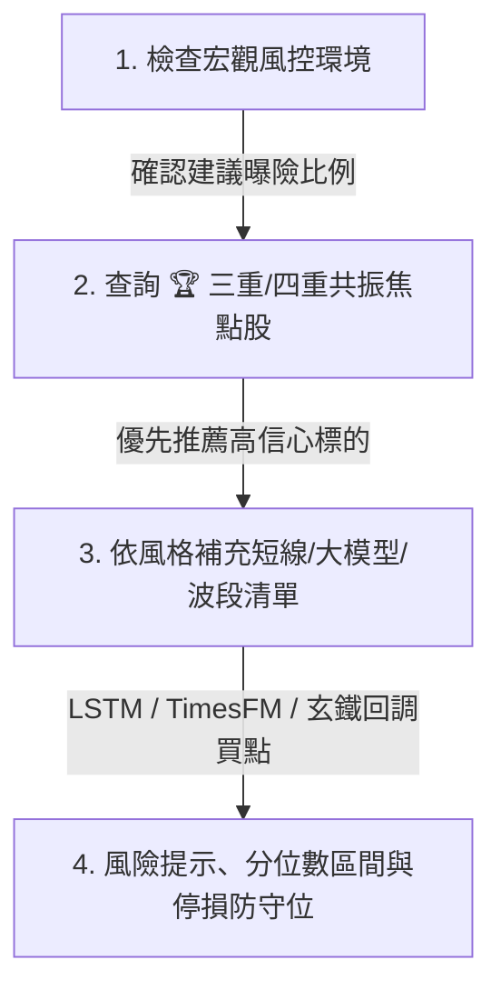

# 📈 888 Stock Quant Agent Skill

## 1. 概述 (Overview)

本 Skill 提供專業級的量化投資決策與標的篩選能力。底層整合 **嵌入式 DuckDB 高速時序資料庫**、**LSTM 深度學習價格預測**、**Google Research TimesFM 時序大模型**、**玄鐵重劍中長線均線波段系統**、**三大法人籌碼追蹤** 以及 **美股與台股大盤宏觀風控（Macro Regime）**。

無論是透過 **MCP Tools**、**WebMCP** 或是 **FastAPI REST 端點**，Agent 皆可透過本 Skill 獲取最新最精確的量化數據並進行操盤解讀。

---

## 2. 核心量化因子與訊號解讀 (Quantitative Factors)

| 因子類別 | 關鍵指標 | 訊號意義與操盤含義 |
| :--- | :--- | :--- |
| 👑 **四重共振** | `is_quad_resonance` | **極高信心買點**：同時滿足「技術均線 ∩ 法人鎖碼 ∩ LSTM 看漲 ∩ TimesFM 看漲」。 |
| 🏆 **三重共振** | `is_triple_resonance` | **高信心買點**：滿足「技術均線 ∩ 法人鎖碼 ∩ (LSTM ∪ TimesFM) 看漲 ∩ 估值合理」。 |
| 🔮 **雙ML共振** | `dual_ml_resonance` | **雙重模型背書**：LSTM 短線動量與 TimesFM 5日路徑同步給出看漲訊號。 |
| ⚔️ **玄鐵重劍** | `pullback_type` (MA60/120) | **波段操作 (2-4週)**：多頭趨勢中股價回踩季線 (MA60) 或半年線 (MA120) 不破之支撐買點。 |
| 🤖 **LSTM 深度學習** | `potential` (%) | **短線操作 (1-7天)**：預測次日價格空間。`potential > +3%` 視為看漲潛力股。 |
| 🔮 **Google TimesFM** | `potential` (%), `risk_reward_ratio` | **時序大模型 (1-5天)**：5 日預測價格路徑、10%~90% 分位數風險帶與盈虧比 (`RR >= 1.5` 為高勝率)。 |
| 🏦 **三大法人籌碼** | `trust_net_5d`, `foreign_net_5d` | **主力籌碼**：`投信連買N天` (Streak >= 3) 或 `土洋合買` (外資投信同步買超)。 |
| 🌍 **宏觀風控** | `macro_regime`, `exposure` | **資金水位控制**：根據加權指數/SPY 季線、VIX 恐慌指數、SOX 費半動態調整倉位 (0% ~ 100%)。 |

---

## 3. 建議分析工作流 (Recommended Advisory Workflow)

當使用者詢問今日股市行情、選股推薦或個股診斷時，Agent 應依循以下四步法：

1. **Step 1: 先看大盤環境與建議曝險 (Macro Regime)**
   - 呼叫 `get_market_macro_regime()`。
   - 若 VIX 飆高或大盤破季線，提醒使用者降低整體倉位（如半倉 50%）。
2. **Step 2: 首選 👑 四重共振與 🏆 三重共振股票 (Resonance Picks)**
   - 呼叫 `get_triple_resonance_stocks()`。
   - 此類標的兼具基本面估值、法人買超、技術均線支撐與 AI/時序大模型看漲。若標籤有 `🔮雙ML共振`，代表勝率極高。
3. **Step 3: 依風格補充候選標的**
   - **波段型投資人**：呼叫 `get_xuantie_pullback_stocks()`（尋找回踩 MA60/120 買點）。
   - **大模型與風控型投資人**：呼叫 `get_timesfm_top_predictions(direction='bullish')`（尋找 5 日動量與高盈虧比標的）。
   - **短線型投資人**：呼叫 `get_lstm_top_predictions(direction='bullish')`（尋找次日爆發股）。
4. **Step 4: 個股診斷與時間序列確認**
   - 呼叫 `get_stock_history(ticker='2330.TW')` 查看個股近期預測軌跡、法人籌碼與均線支撐。

---

## 4. MCP Tools 快速對照表 (16 大標準 FastMCP / WebMCP 工具)

| MCP Tool 名稱 | 參數 | 回傳說明 |
| :--- | :--- | :--- |
| `get_market_macro_regime` | `market`, `index_name` | 台美股大盤情境、VIX 指數、季線狀態、建議曝險百分比 (0~100%) |
| `get_triple_resonance_stocks` | `index_name`, `limit` | 👑 四重共振、🏆 三重共振與 🔮 雙ML共振多策略焦點交集股清單 |
| `get_xuantie_pullback_stocks` | `index_name`, `pullback_type`, `limit` | 玄鐵重劍 MA60/MA120 回調買點清單 |
| `get_timesfm_top_predictions` | `index_name`, `direction`, `limit` | Google TimesFM 時序大模型漲跌幅排行與盈虧比 (Risk/Reward) |
| `get_lstm_top_predictions` | `index_name`, `direction`, `limit` | LSTM 預測次日漲幅 TOP N 或 跌幅 TOP N 避險榜 |
| `get_stock_history` | `ticker`, `limit` | 指定代號之歷史時序量化預測與指標軌跡 |
| `get_latest_market_snapshot` | `index_name`, `limit` | 當日最新完整日報批次數據快照 |
| `get_top_institutional_flows` | `order_by`, `sort_dir`, `market`, `limit` | 三大法人（外資、投信、自營商）買賣超排行榜 |
| `get_broker_trades_for_stock` | `ticker`, `days` | 券商關鍵分點主力買賣超追蹤 |
| `get_company_profile` | `ticker` | 2MD 繁中公司簡介、核心業務、市值與即時新聞 |
| `get_fed_rate_monitor` | `force_refresh` | CME FedWatch 聯準會利率決策機率分布表與 FOMC 倒數 |
| `get_us_earnings_calendar` | `force_refresh`, `limit` | Investing.com 美股近期重量級財報行事曆（EPS、營收預估） |
| `get_economic_calendar` | `force_refresh`, `limit` | 全球重大總經行事曆（CPI、非農 NFP、GDP、PCE） |
| `get_commodities_summary` | `force_refresh` | 關鍵大宗商品（黃金 Gold、銅博士 Copper、WTI 原油）實時行情 |
| `resolve_stock_ticker` | `query` | 將中英文股票名稱模糊解析為標準交易代號（如台積電 ➔ 2330.TW） |
| `get_polymarket_macro_sentiment` | `category`, `force_refresh` | Polymarket 真金白銀預測市場宏觀情緒（聯準會降息機率、美股牛熊、科技AI突破、地緣政治衰退機率） |

---

## 5. REST API 端點對照 (Base URL: `https://stockdata.david888.com` / `http://10.9.0.99:8088`)

- `GET /llms.txt` - LLM 系統摘要與標準端點導引 ([llmstxt.org](https://llmstxt.org/))
- `GET /llms-full.txt` - 完整開發者與大模型參考手冊 (含數學公式、DuckDB Schema、MCP 工具定義)
- `GET /.well-known/mcp.json` - WebMCP 遠端發現規格清單 (16 大量化工具)
- `GET /mcp/sse` - WebMCP SSE 串流通訊端點
- `GET /api/v1/macro/latest` - 宏觀風控狀態與建議曝險
- `GET /api/v1/macro/investing/summary` - 一站式總經數據彙整 (FedWatch、財報、大宗商品、日曆)
- `GET /api/v1/macro/polymarket/sentiment` - Polymarket 宏觀情緒與聯準會降息真金白銀預測機率
- `GET /api/v1/macro/investing/fed-rate` - 聯準會利率決策機率與 FOMC 倒數
- `GET /api/v1/macro/investing/earnings-calendar` - 美股重量級企業財報行事曆
- `GET /api/v1/macro/investing/commodities` - 黃金、原油、銅博士實時報價
- `GET /api/v1/macro/investing/economic-calendar` - 全球重磅總經行事曆
- `GET /api/v1/predictions/resonance` - 三重/四重共振焦點股
- `GET /api/v1/predictions/xuantie` - 玄鐵均線買點
- `GET /api/v1/predictions/timesfm/top-bullish` - TimesFM 5日看漲榜與盈虧比
- `GET /api/v1/predictions/timesfm/top-bearish` - TimesFM 5日避險看跌榜
- `GET /api/v1/predictions/lstm/top-bullish` - LSTM 次日看漲榜
- `GET /api/v1/predictions/lstm/top-bearish` - LSTM 次日看跌榜
- `GET /api/v1/predictions/history/{ticker}` - 個股時序歷史
- `GET /api/v1/predictions/resolve/{query}` - 股票名稱與代號模糊解析
- `GET /api/v1/market/institutional/top` - 法人買賣超排行
- `GET /api/v1/market/broker/summary/{ticker}` - 券商主力分點累計進出
- `GET /api/v1/market/company-profile` - 2MD 公司營運簡介
- `GET /api/v1/predictions/latest` - 最新批次日報
- `GET /api/v1/stats/summary` - 資料庫時序統計
